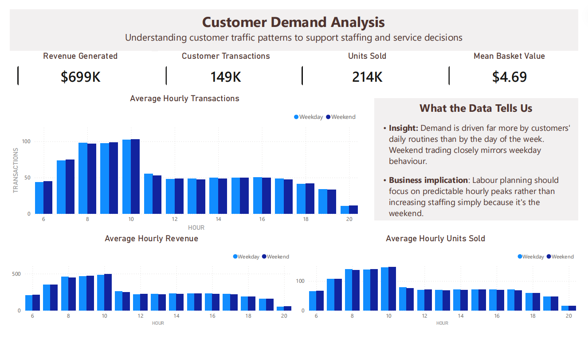
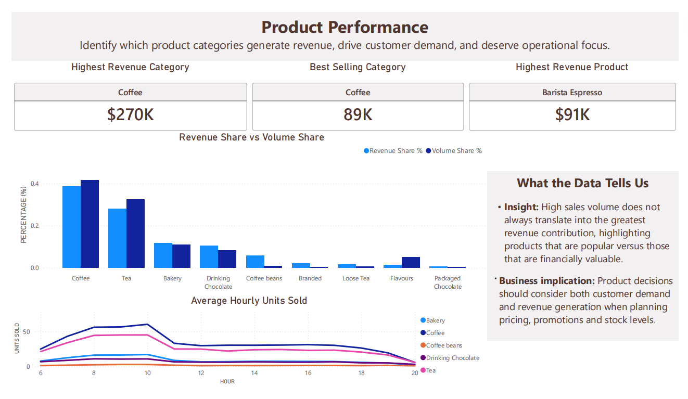
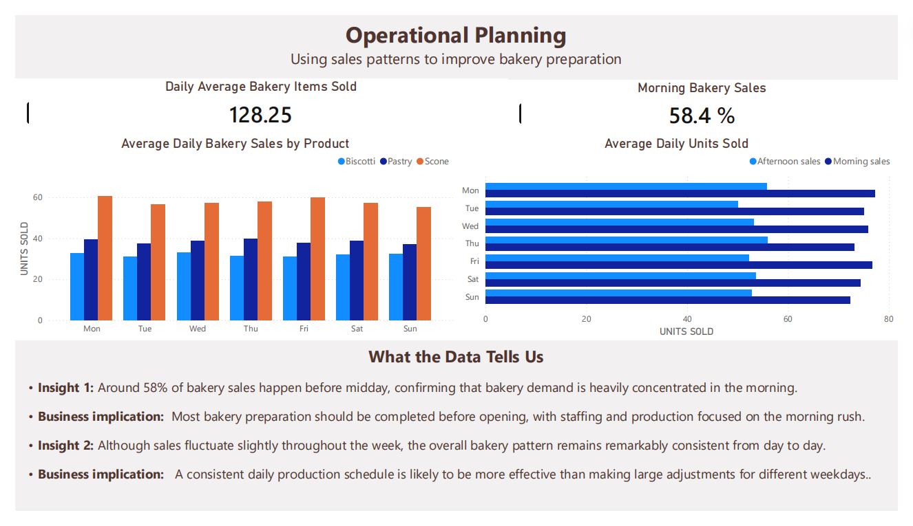

# ☕ Operational Analytics for Small Hospitality Businesses

## Can transaction data improve operational decisions traditionally driven by intuition?

### Project Overview

Hospitality has always been an industry built on experience. Managers learn when to schedule staff, what products to prepare, and how to organise the day largely through observation and intuition. Having worked in hospitality myself, and having grown up around my family's cafés and bars, I wanted to explore a simple question:

> **Can transaction data validate, challenge, or improve those instinctive decisions?**

This project uses a public Kaggle coffee shop dataset as a stand-in for a small independent café. Rather than treating it as a typical sales analysis exercise, I approached it as an operational business case.

The objective was not simply to identify what sold the most, but to investigate whether historical transaction data could support better day-to-day operational decisions around product focus, staffing, and the daily rhythm of the business.

---

# The Business Question

The project was built around one central question:

**Can data analysis complement operational intuition and lead to better business decisions?**

To answer this, the analysis focused on three areas that directly influence the running of a hospitality business.

## Product Strategy

Which products genuinely drive revenue?

Can transaction data help identify products that deserve greater operational focus, promotion, or menu simplification?

## Staffing & Capacity Planning

How does customer demand change throughout the trading day?

Are staffing decisions supported by demand patterns, or are they based on assumptions?

## Daily Operational Rhythm

Does the business follow predictable trading patterns?

Can transaction data help inform preparation schedules, operational timing, and daily workflow?

Rather than beginning with the data, the project began with these business questions. The analysis was then designed to answer them.

---

# Why This Project Was Built

This project intentionally demonstrates the same analytical workflow across multiple technologies.

The business problem remains constant, while the implementation changes.

- **Python** was used to validate, clean, and engineer analytical features.
- **PostgreSQL** was used to model the data, create reusable reporting views, and answer business questions using SQL.
- **Power BI** was used to recreate the reporting layer and communicate the findings through interactive dashboards.

Rebuilding the workflow in each environment was a deliberate learning exercise to demonstrate different analytical approaches rather than replicate a production pipeline.

---

# Analytical Workflow

```
Business Questions
        ↓
Data Validation
        ↓
Feature Engineering
        ↓
Database Modelling
        ↓
Business Analysis
        ↓
Interactive Reporting
```

Every transformation, SQL query, and dashboard visual was created to support a business question rather than simply explore the dataset.

---

# Power BI Dashboard

The final stage of the project was recreating the business analysis in Power BI.

Rather than building dashboards for the sake of visualisation, each report page answers a specific operational question. Every chart and KPI was first developed in Python, reproduced in SQL, and finally rebuilt in Power BI to demonstrate the same analytical workflow across multiple tools.

---

## Customer Demand Analysis



Examines customer traffic throughout the trading day to understand whether staffing decisions should be driven by time of day or by weekday versus weekend demand.

**Key finding**

Customer demand follows remarkably consistent hourly patterns throughout the week, suggesting that staffing decisions should focus on predictable daily peaks rather than assumed weekend increases.

---

## Product Performance



Compares revenue contribution with sales volume to distinguish products that generate customer demand from those that generate the greatest financial return.

**Key finding**

Sales volume alone can be misleading. Comparing revenue share with volume share highlights the difference between popular products and those that contribute most to revenue, supporting better pricing, stock and promotional decisions.

---

## Operational Planning



Applies the analysis to a practical operational question: how should bakery production be scheduled throughout the day?

**Key finding**

Around 58% of bakery sales occur before midday, confirming that preparation should be completed before opening. Bakery demand also remains remarkably consistent throughout the week, suggesting that a stable production schedule is likely to be more effective than making large day-to-day adjustments.

---

# About the Dataset

This project uses the publicly available **Coffee Shop Sales** dataset from Kaggle.

Although the dataset is not taken from a real business that I have worked with, the analytical questions, feature engineering decisions, and business interpretation were informed by my experience in hospitality and my understanding of how small hopsitality businesses operate.

The emphasis of the project is therefore not on handling messy real-world data, but on demonstrating how analytical techniques can be applied to operational decision-making.

---

# Project Status

- ✅ Data validation and feature engineering in Python
- ✅ Relational database design in PostgreSQL
- ✅ SQL reporting views and business analysis
- ✅ Interactive Power BI dashboard
- ✅ Business recommendations supported by data

---

# What I Learned

One of the biggest lessons from this project is that analytics and experience are not competing approaches.

Good operational intuition often comes from years of observing customers and understanding how a business functions. Quite often we do the "analysis" ourselves without being fully aware of the details.

Data analysis provides a way to test those assumptions, uncover patterns that may otherwise be missed, and support decisions with evidence.

This project also reinforced something from my hospitality background, that good analysis starts with understanding the business problem, not the data. Every SQL query, Python notebook, and dashboard visual was built to answer an operational question that a café owner could actually act upon.

Analytics and experience are a powerful combination, providing both confidence in decision-making and opportunities to improve how a business operates.